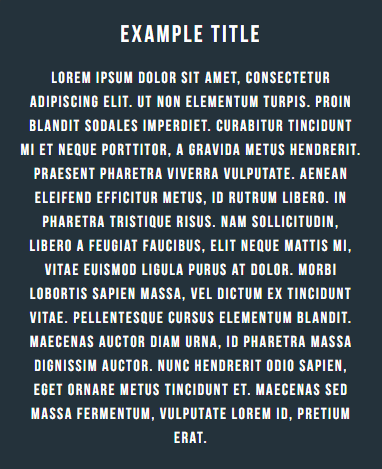
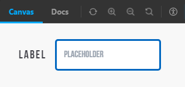

<body>

    <a href="https://beta.reactjs.org/">
        <picture>
            <source media="(prefers-color-scheme: dark)" srcset="public/logo192.png">
            <source media="(prefers-color-scheme: light)" srcset="public/logo192.png">
            
        </picture>
    </a>

 

Reusable React Functional Components

</body>

---

# Article Component

    This component showcases a default or async aritcle that comprises a title and body sub-components,
    respectively

|               Desktop View                |                            Mobile View                            |
|:-----------------------------------------:|:-----------------------------------------------------------------:|
|  |  |

# Form Component

    This component showcases a form that includes a call to action, name, email, subject, message, and button 
    sub-components.

|            Desktop View             |                         Mobile View                         |
|:-----------------------------------:|:-----------------------------------------------------------:|
|  |  |

# Navigation Component

    This component showcases a simple navigation bar that includes your company logo, menu items, and social 
    media logos sub-components.

|                  Desktop View                   |                               Mobile View                               |
|:-----------------------------------------------:|:-----------------------------------------------------------------------:|
|  |  |

# Section Menu Component

    This component showcases a section menu navigation bar that includes a section menu items sub-component

|                    Desktop View                     |                                 Mobile View                                 |
|:---------------------------------------------------:|:---------------------------------------------------------------------------:|
|  |  |

# Button & Input Components

    These components showcases a simple button and input, respectively. 

|            Button Component             |            Input Component            |
|:---------------------------------------:|:-------------------------------------:|
|  |  |
